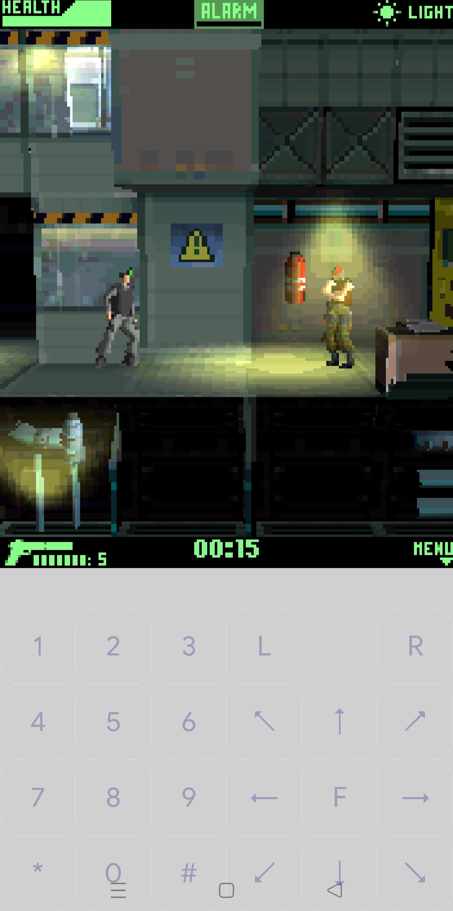
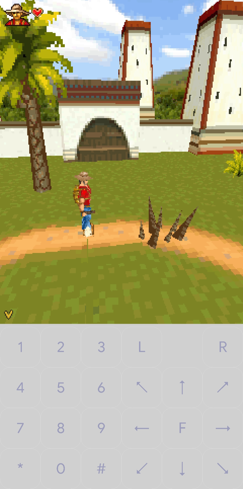
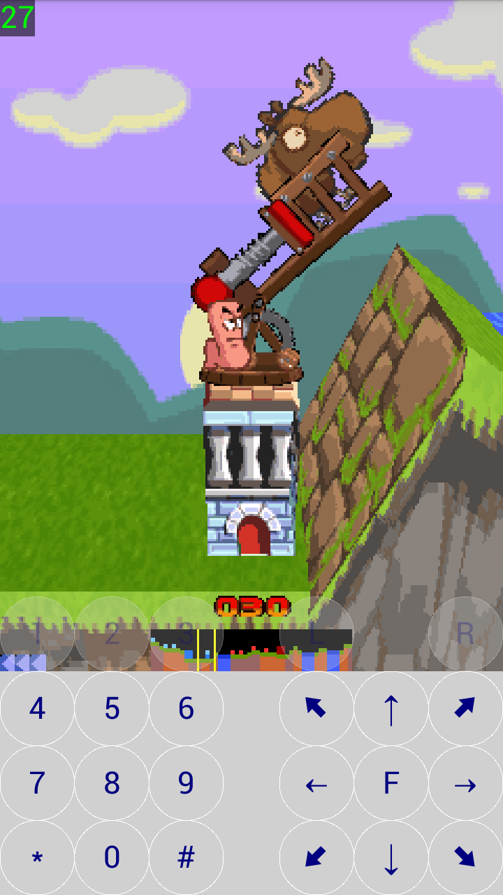

# JL-Mod Plus

JL-Mod Plus is a fork of [JL-Mod](https://github.com/woesss/JL-Mod), an unofficial fork of ["J2ME-Loader" (a J2ME emulator for Android)](https://github.com/nikita36078/J2ME-Loader).

JL-Mod Plus uses the application ID `io.github.h3nb.jlmodplus`, so it can be installed alongside upstream JL-Mod. It uses its own signing identity and cannot replace or update an upstream installation.

| Channel | Purpose | Architecture |
| --- | --- | --- |
| Development | Local testing and continuous builds | `arm64-v8a` only |
| Release | Public GitHub release | Universal APK with every ABI supported by the project |

JL-Mod Plus is currently pre-1.0 experimental software. There is no stable public JL-Mod Plus release yet; the first planned version is `0.1.0`. Testers can use the [continuous development build](https://github.com/H3nb/JL-Mod-Plus/releases/tag/continuous), or read the [contribution guide](CONTRIBUTING.md) to build locally.

  

### **!!!Attention!!!**
**Some settings have been changed in the mod. J2ME Loader may not work correctly with games, templates and settings installed or configured by the mod and vice versa. In order not to have to reinstall-reconfigure, it is better to make a backup, copy or not specify the same working directory for the mod and J2ME Loader.**

#### **Using shaders (image post-processing filters)**

  Supports the same shader format as [PPSSPP](https://www.ppsspp.org)
  To use, you need to put them in the `shaders` folder in the working directory of the emulator,
  then in the game profile, select the graphics output mode: "Hardware (OpenGL ES)" and select the desired shader.
  Some shaders have settings - when you select one, an icon will appear next to the name, when you click on it, a window with settings will open
  A small collection of compatible shaders can be found in this repository: https://github.com/woesss/ppsspp_shaders

#### **Using sound banks for midi playback (DLS, SF2)**

  Soundbank files (DLS, SF2) should be placed in the `soundbanks` folder in the working directory of the emulator.
  Next, in the game profile settings in the `Audio` section, select the desired one.
  SF2 support is still in beta mode - only standard midi files are supported.
  Not all banks are supported by the synthesizers used (Sonivox, TinySoundFont).
  If the bank or audio file is not supported, playback will automatically switch to a standard player with a standard bank.

#### **Background image (skin)**

  The image file in any format supported by Android must be placed in the `skins` folder in the emulator's working folder.  
  Next, in the game profile settings, select it.  
  The position and size of the virtual screen can be adjusted using the scale and padding settings.  
  You can also set the screen in the image: a rectangular area filled with transparent black (`#00000000`).  
  The emulator will automatically place the game screen in this area.  
  The reaction to the skin buttons can be made by overlaying the virtual keyboard buttons, and the keyboard itself can be made completely transparent.  

#### **Mascot Capsule v3 support**
  In some games (seen in "Medal of Honor") the 3D scene may not be displayed due to the overlap with the 2D background.
  Try adding the following line to the "System Properties" field:
  **micro3d.v3.render.no-mix2D3D: true**
  If it doesn't help, please report this game in [bug-report](https://github.com/H3nb/JL-Mod-Plus/issues/new?assignees=&labels=bug&template=issue-template.md&title=) or in another way.

  Another one property turns on the texture filter (built into OpenGL), but this can generate distortion in the form of extra texels being captured at the edges of polygons:
  **micro3d.v3.texture.filter: true**
   without this setting, the quality of the textures is as close to the original as possible and looks more vintage.

#### **Porting**
  Added the ability to build an Android application from the source code of a J2ME application using the code of this project  
  Read more in the [Wiki](https://github.com/H3nb/JL-Mod-Plus/wiki/Porting-midlet-instruction)

#### **Development and releases**

Pull requests target `dev`. Public releases are signed universal APKs created from version tags on the protected `master` branch. App versions start at `0.1.0` and are independent of the upstream JL-Mod version; see [versioning](docs/VERSIONING.md). The locked [`baseline` branch](docs/BASELINE.md) preserves an unmodified upstream `dev` snapshot for troubleshooting. See [CONTRIBUTING.md](CONTRIBUTING.md) for development and [the release checklist](docs/RELEASING.md) for publishing.

#### **License and credits**

JL-Mod Plus is distributed under the [Apache License 2.0](LICENSE). It preserves the work and attribution of JL-Mod, J2ME Loader, and their contributors. JL-Mod Plus modifications are copyright 2026 H3NB and their respective contributors. Bundled third-party components remain under their own licenses; see [third-party notices](THIRD_PARTY_NOTICES.md) and the in-app licenses page.

AI-assisted contributions are welcome, but contributors remain responsible for testing their changes and ensuring submitted code is compatible with the repository's licenses.

#### **External links**  
Emulation General Wiki:  
[JL-Mod](http://emulation.gametechwiki.com/index.php/JL-Mod)  
[Mascot Capsule 3D](http://emulation.gametechwiki.com/index.php/Mascot_Capsule_3D)  
[Mascot Capsule 3D compatibility list](https://emulation.gametechwiki.com/index.php/Mascot_Capsule_3D_compatibility_list)  
