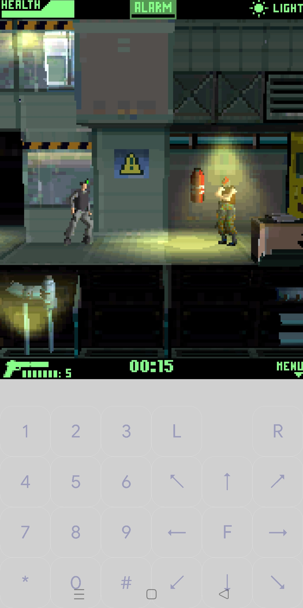
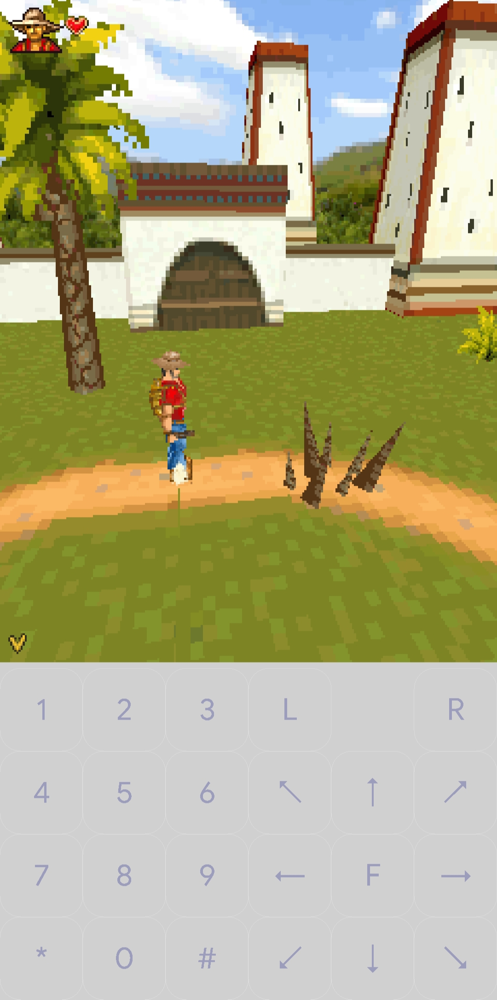

  
[Go to English](README.md)  

Экпериментальный мод ["J2ME Loader" (J2ME эмулятор для Android)](https://github.com/nikita36078/J2ME-Loader) с поддержкой игр, разработанных для 3D движка "Mascot Capsule v3"

  

### **!!!Внимание!!!**
**В моде изменены некоторые настройки. Оригинальный "J2ME Loader" может работать неправильно с играми, шаблонами и настройками установленными или настроенными модом. Что бы не пришлось переустанавливать-перенастраивать лучше сделать бекап, копию и не указывать рабочей папкой "J2ME-Loader" вообще.**  

#### **Список изменений:**  

- Выбор рабочей папки. 
- Хранение базы данных в рабочей папке.
- Индикаторы выбранных цветов кнопок в настройках.
- Шаблоны переименованы в "профили".
- Назначение любого профиля стандартным (при сохранении или в окне профилей).
- Добавление, редактирование и назначение стандартным в окне со списком профилей.
- Ограничение в 1 сек. на принудительное завершение мидлета.
- Диалоги подтверждения при переустановке существующих.
- Выбор кодировки перенесён в индивидуальные настройки, кнопка выбора из всех поддерживаемых системой.
- Выбор формы кнопок перенесён в индивидуальные, добавлен вариант с закруглёнными углами.
- Изменено редактирование клавиатуры:
  при перетаскивании кнопки не тащат за собой другие;
  масштабирование разделено по горизонтали и вертикали (можно делать прямоугольными или овальными).
- Поле "Системные параметры" перенесено в конец настроек,  
  снято ограничение количества отображаемых строк,
  добавлен показ всех параметров, добавляемых эмулятором.
- Подключение внешних фильтров (шейдеров). Поддерживается формат шейдеров для [PPSSPP](https://www.ppsspp.org)
  Для использования нужно положить их в папку `shaders` в рабочей папке эмулятора,  
  далее в настройках игры выбрать режим вывода графики: "Аппаратный (OpenGL ES)" и выбрать интересующий шейдер
  Небольшую подборку совместимых шейдеров можно взять в этом рерозитории: https://github.com/woesss/ppsspp_shaders

#### **Поддержка Mascot Capsule v3 (alpha build):**  
  реализация не полная, есть не решённые проблемы  

Основные проблемы:  
  спец-эффекты не реализованы никак (освещение, затенение, отражение) - поэтому цветопередача может отличаться от оригинала.  
  есть проблемы с точечными спрайтами (обычно используются для вывода мелких объектов) - могут криво отображаться или производить артефакты,  
  если будут раздражать - можно их отключить, добавив в настройках в поле "Системные параметры" строку:  
  **micro3d.v3.skipSprites: true** 

 Ещё один параметр включает фильтр текстур (примитивный, встроенный в OpenGL), но это может порождать искажения в виде захвата лишних текселей по краям полигонов:  
 **micro3d.v3.texture.filter: true**  
 без этого параметра качество текстур максимально приближено к оригиналу и выглядит более винтажно (квадратно-ступенчато))).  
 
 В некоторых играх (замечено в "Medal of Honor") 3D-сцена может не отображаться из-за перекрытия 2D-фоном.  
 Попробуйте добавить в поле "Системные параметры" строку:  
 **micro3d.v3.render.no-mix2D3D: true**  
 Если не поможет - сообщите об этой игре в [баг-репорт](https://github.com/woesss/JL-Mod/issues/new?assignees=&labels=bug&template=issue-template.md&title=) или другим способом.  
     
 [Скачать APK](https://github.com/woesss/J2ME-Loader-Mod/releases)
